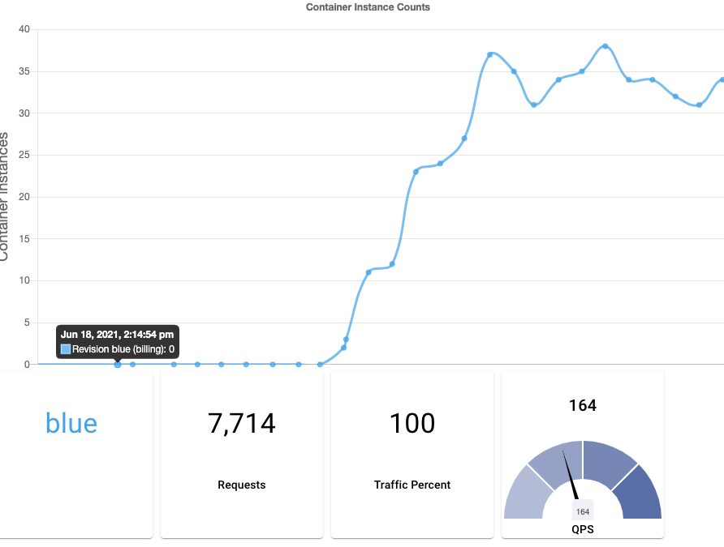
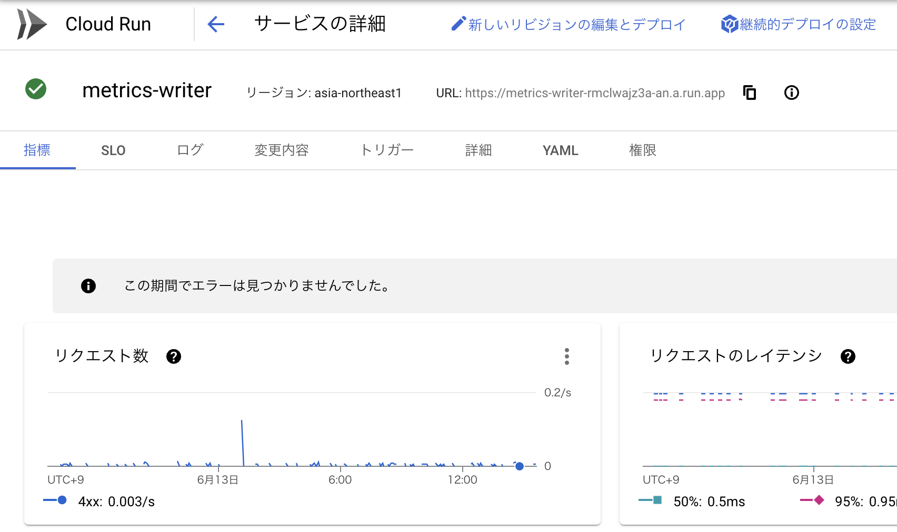
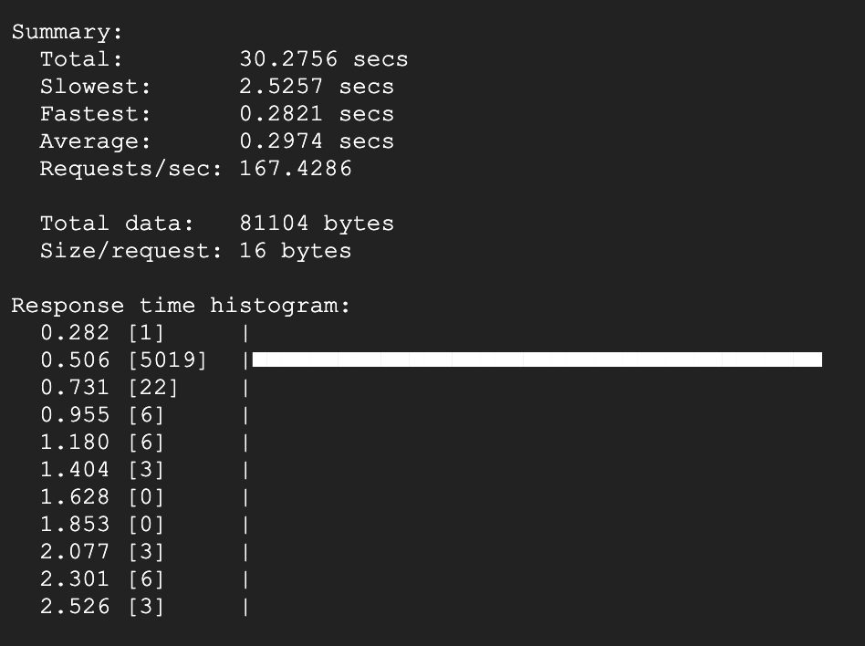
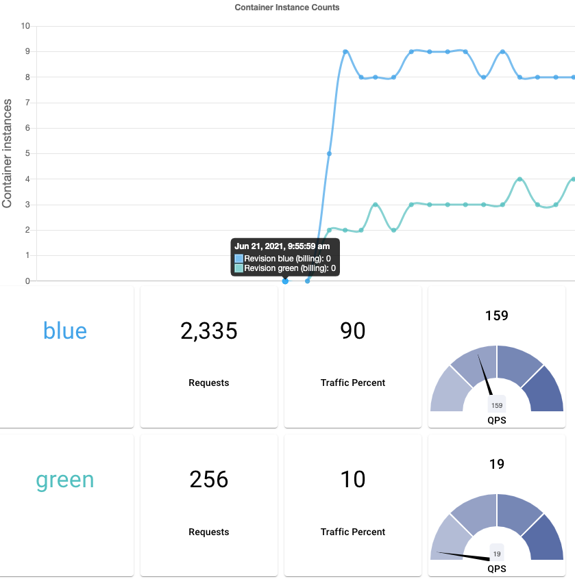
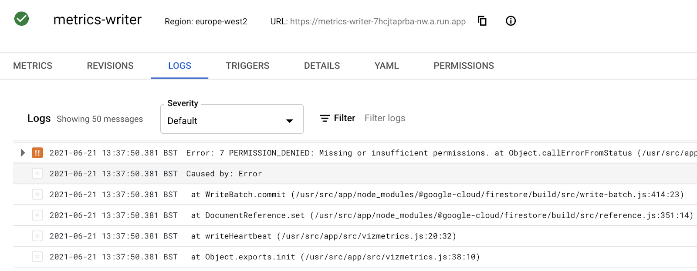

# GIG ハンズオン (Cloud Native)

## Google Cloud プロジェクトの選択

ハンズオンを行う Google Cloud プロジェクトを作成し、 Google Cloud プロジェクトを選択して **Start/開始** をクリックしてください。

**なるべく新しいプロジェクトを作成してください。**

<walkthrough-project-setup></walkthrough-project-setup>
<walkthrough-watcher-constant key="region" value="asia-northeast1"></walkthrough-watcher-constant>

## **参考: Cloud Shell の接続が途切れてしまったときは?**

一定時間非アクティブ状態になる、またはブラウザが固まってしまったなどで `Cloud Shell` が切れてしまう、またはブラウザのリロードが必要になる場合があります。その場合は以下の対応を行い、チュートリアルを再開してください。

### **1. チュートリアル資材があるディレクトリに移動する**

```bash
cd ~/cloudshell_open/gig-training-materials/gig04-3/
```

### **2. チュートリアルを開く**

```bash
teachme tutorial.md
```

### **3. gcloud のデフォルト設定**

```bash
source vars.sh
```

途中まで進めていたチュートリアルのページまで `Next` ボタンを押し、進めてください。

## [解説] ハンズオンの内容

### **概要**
このラボでは、いくつかの重要なクラウドネイティブ開発原則に基づいて Cloud Run を実装します。 ラボは各セクションに分かれています。 各セクションでは、特定のクラウドネイティブ原則を示すように Cloud Run サービスを構成します。

Cloud Native Computing Foundation（CNCF）の定義によると、「クラウドネイティブテクノロジーにより、組織は、パブリック、プライベート、ハイブリッドクラウドなどの最新の動的環境でスケーラブルなアプリケーションを構築および実行できます。コンテナ、サービスメッシュ、マイクロサービス、イミュータブルインフラストラクチャ、および 宣言型 API は、このアプローチの例です。これらの手法により、復元力、管理性、監視性を備えた疎結合システムが実現可能になります。堅牢な自動化と組み合わせることで、エンジニアは最小限の労力で頻繁かつ予測どおりに影響の大きい変更を行うことができます。」

次の図は、ラボの開始状態を示しています。 アーキテクチャは完全にサーバーレスです。 Cloud Firestore NoSQL データベースと相互作用するコンテナ化された Web サービスを Cloud Run にデプロイします。


このアーキテクチャは、2つのCloudRunサービスで構成されています。

Metrics writer

- メトリックを Cloud Firestore データベースに書き込むシンプルな「helloworld」スタイルのサービス。
- 各メトリックライターインスタンスは、1秒ごとにハートビートレコードを Cloud Firestore データベースに書き込みます。

> ハートビートレコードは、インスタンスがアクティブであるかどうか（要求を処理しているかどうか）、最後の1秒間に受信した要求の数、およびその他のメタデータを示します

Visualizer web app

- Cloud Run でホストされ、メトリックライターインスタンスによって永続化されたメトリックを読み取り、いい感じのグラフを表示するウェブアプリ。.

### **目的**
このラボでは、次のタスクを実行します。

- コンテナ化されたサービスを Cloud Run にデプロイします
- スケーリング動作を示すために Cloud Run に対して負荷を生成します
- ネットワークトラフィックを操作するためのロードバランサーとトラフィック分割ルールを構成します
- Cloud Run サービスへのアクセスを制限するように IAM とセキュリティルールを構成します。

## 1. Containers はユニバーサル
> _**クラウドネイティブの原則**: コンテナは、クラウドネイティブソフトウェアにおける、標準化されたイミュータブルなユニットです。_

このタスクでは、環境を設定し、最初のアーキテクチャをデプロイします。

- ビルド済みのコンテナイメージを使用して Cloud Run サービスを展開します。
- イメージが使用するプログラミング言語、Webフレームワーク、または依存関係は関係ありません。
- イメージは、標準化されたユニバーサルなフォーマットでパッケージ化されています。
- イメージは、変更することなく、さまざまなコンテナ実行環境に展開できます。

### 環境のセットアップ
1. `Cloud Shell` を開きます

2. このラボのスクリプトを含む git リポジトリをクローンします。 gcloud の承認を求められた場合は、承認してください。.

```bash
git clone https://github.com/google-cloud-japan/gig-training-materials.git
```

3. リポジトリディレクトリに移動します
```bash
cd gig04-3
```
<!-- シェルの中のリージョンを変更する必要あり <- done -->
4. スクリプトを実行して、プロジェクト ID とデフォルトリージョンのシェル変数を設定します。.
```bash
source vars.sh
```

5. デフォルトで Cloud Run のマネージド環境を利用するよう、 `gcloud` コマンドで設定します。
```bash
gcloud config set run/platform managed
```

6. 必要な API を有効にします
```bash
gcloud services enable run.googleapis.com \
  firestore.googleapis.com \
  appengine.googleapis.com \
  compute.googleapis.com
```

7. App Engine を初期化します。このラボでは App Engine を使用しませんが、次のステップで Firestore データベースを作成する前に App Engine を初期化する必要があります
```bash
gcloud app create --region $REGION
```

8. Firestore データベースを作成します。
```bash
gcloud firestore databases create --region $REGION
```

### metrics-writer コンテナをローカルで実行する
ここでは、metrics-writer コンテナをローカルで実行します。公開されている Google Artifacts Registry からコンテナイメージを取得します。コンテナイメージは実行可能であり、完全に自己完結型です。すべてがイメージにパッケージ化されているため、依存関係やランタイム環境をインストールする必要はありません。

<!-- Source = https://source.cloud.google.com/cnaw-workspace/cloudrun-visualizer/+/master:README.md -->
1. metrics-writer コンテナイメージをローカルの Cloud Shell インスタンスにダウンロードします
```bash
docker pull asia-northeast1-docker.pkg.dev/gig4-3/gig4-3/metrics-writer:latest
```

2. イメージを実行します。プロジェクト ID に環境変数を設定し、ローカルポートをコンテナポートにマップします。
```bash
docker run \
  -e GOOGLE_CLOUD_PROJECT=${PROJECT_ID} \
  -p 8080:8080 \
  asia-northeast1-docker.pkg.dev/gig4-3/gig4-3/metrics-writer:latest
```

以下のような出力が表示されます

**Output**
```terminal
> hello-world-metrics@0.0.1 start /usr/src/app
> functions-framework --target=helloMetrics --source ./src/

Serving function...
Function: helloMetrics
Signature type: http
URL: http://localhost:8080/
```

3. 新しい Cloud Shell タブを開きます

4. 新しい Cloud Shell タブで、ローカルコンテナを呼び出します。
```bash
curl localhost:8080
```

以下のような出力が表示され、正常な応答を示しています。

**Output**
```terminal
Hello from blue
```

5. 最初の Cloud Shell タブに戻ります。メトリックスケジュールが開始していることが示されています。これらのログは無視してかまいません。

**Output**
```terminal
URL: http://localhost:8080/
initialising instance: 7229f512-6676-4211-90ca-80545c26aeb1
starting metrics schedule...
Metrics: id=7229f512, activeRequests=0,  requestsSinceLast=1
Metrics: id=7229f512, activeRequests=0,  requestsSinceLast=0
```

>Note: エラーが発生した場合は、しばらく待ってから、上記の手順（手順2から手順5）のコマンドを再実行してください。

6. control-c でローカル実行されているコンテナを停止します。

### 初期アーキテクチャのデプロイ

1. `metrics-writer` アプリを Cloud Run にデプロイします。Google Artifact Registry からのビルド済みコンテナイメージを使用します。
```bash
gcloud run deploy metrics-writer \
  --concurrency 1 \
  --allow-unauthenticated \
  --image asia-northeast1-docker.pkg.dev/gig4-3/gig4-3/metrics-writer:latest
```

以下のような出力が表示されます

**Output**
```terminal
Deploying container to Cloud Run service [metrics-writer] in project [gig4-3] region [asia-northeast1]
OK Deploying new service... Done.
  OK Creating Revision... Revision deployment finished. Checking container health.
  OK Routing traffic...
  OK Setting IAM Policy...
Done.
Service [metrics-writer] revision [metrics-writer-00001-ras] has been deployed and is serving 100 percent of traffic.
Service URL: https://metrics-writer-rmclwajz3a-an.a.run.app
```

2. metrics-writer サービスの URL の値を使用してシェル変数を設定します
```bash
export WRITER_URL=$(gcloud run services describe metrics-writer --format='value(status.url)')
```

3. metrics-writer サービスと対話できることを確認します。 [SERVICE_URL] を前のコマンドの出力からのサービス URL の値に置き換えます。
```bash
curl $WRITER_URL
```

以下のような出力が表示されます

**Output**
```terminal
Hello from blue
```

4. `visualizer`　アプリを Cloud Run にデプロイします。ここでも、Google Artifact Registry から事前に作成されたコンテナイメージを使用します。
```bash
gcloud run deploy visualizer \
  --allow-unauthenticated \
  --max-instances 5 \
  --image asia-northeast1-docker.pkg.dev/gig4-3/gig4-3/visualizer:latest
```

5. visualizer サービスは Web アプリです。ローカルマシンで、Web ブラウザを開いてサービス URL にアクセスし、deploy コマンドの出力から URL 値をコピーします。

以下のような空のグラフが表示されます:


6. Cloud Run サービスを一覧表示します。metrics-writer と visualizer の2つのサービスが表示されます。
```bash
gcloud run services list
```

You see output like below

**Output**
```terminal
✔
SERVICE: metrics-writer
REGION: asia-northeast1
URL: https://metrics-writer-rmclwajz3a-an.a.run.app
LAST DEPLOYED BY: admin@hiroyukimomoi.altostrat.com
LAST DEPLOYED AT: 2022-06-09T02:12:43.845980Z

✔
SERVICE: visualizer
REGION: asia-northeast1
URL: https://visualizer-rmclwajz3a-an.a.run.app
LAST DEPLOYED BY: admin@hiroyukimomoi.altostrat.com
LAST DEPLOYED AT: 2022-06-09T04:38:29.682058Z
```

7. [Cloud Run セクション](https://console.cloud.google.com/run) にアクセスして、サービスの内容を確認します。

## 2. スケールアウト対応

>_**クラウドネイティブの原則**: クラウドネイティブアプリはステートレスでディスポーザブルであり、高速の自動スケーリング用に設計されています。_

このモジュールでは、metrics-writer の Cloud Run サービスに対してトラフィックを生成して、自動スケーリングの動作を確認します。次に、サービスの構成を変更して、スケーリング動作への影響を確認します。


### Cloud Run コンテナインスタンスの自動スケーリング

Cloud Runでは、アクティブな各 [リビジョン](https://cloud.google.com/run/docs/resource-model#revisions) は、着信要求を処理するために必要なコンテナインスタンスの数に自動的にスケーリングされます。詳細については、 [インスタンスの自動スケーリング](https://cloud.google.com/run/docs/about-instance-autoscaling) のドキュメントを参照してください。

作成されるインスタンスの数は、次の影響を受けます。
- 既存のインスタンスのCPU使用率（インスタンスを 60％ の CPU 使用率で提供し続けることを目標としています）
- [インスタンスあたりの同時リクエストの最大数（サービス）](https://cloud.google.com/run/docs/about-concurrency)
- [コンテナ インスタンス（サービス）の最大数](https://cloud.google.com/run/docs/configuring/max-instances)
- [最小インスタンス数（サービス）](https://cloud.google.com/run/docs/configuring/min-instances)

### リクエスト トラフィックを生成する

1. Cloud Shell を開きます。以前のシェルがしばらく非アクティブだった場合は、再接続が必要になる場合があります。その場合は、再接続後、リポディレクトリに移動し、環境変数を再設定します。

```bash
cd ~/cloudshell_open/gig-training-materials/gig04-3/ && source vars.sh
```

2. Cloud Run サービスを一覧表示します。
```bash
gcloud run services list
```

3. まだ開いていない場合は、visualizer サービスの URL への Web ブラウザーページを1つ開きます。

4. [hey](https://github.com/rakyll/hey) コマンドラインユーティリティを使用して、サービスに 30 ワーカーで 30 秒間リクエストトラフィックを生成します。 `hey` ユーティリティはすでに Cloud Shell にインストールされています。
```bash
hey -z 30s -c 30 $WRITER_URL
```

5. visualizer Web アプリを表示するブラウザーページに切り替えます。ページにグラフがプロットされています。 Cloud Run は、トラフィック量を処理するためにアクティブなインスタンスの数を急速に拡大しました。



6. 30 秒が経過するまでグラフを監視します。 Cloud Run は、インスタンスがゼロになるまで急速にスケールダウンします。アクティブなインスタンスのピーク数を覚えておいてください。

7. cloud shell に戻ります。 `hey` ユーティリティは、負荷テストの要約を出力します。要約メトリックと応答時間のヒストグラムを見てください。


8. クラウドコンソールの [Cloud Run セクション](https://console.cloud.google.com/run) にアクセスします。`metrics-writer` サービスをクリックし、`指標` タブを選択します。



Cloud Run は、リクエスト数、リクエストレイテンシ、コンテナインスタンス数など、すぐに使用できる便利な[モニタリング指標]を提供していることがわかります。

9. 期間を「1時間」に変更し、「コンテナ インスタンス 数」グラフを確認します。 ピークの「アクティブな」インスタンス値は、ビジュアライザーグラフに表示された値とほぼ一致する必要があります。 グラフが更新されるまで約 3 分待つ必要があります。

>Note: クラウドコンソールの[指標]タブには、Cloud Run サービスに関する最も正確な情報が表示されます。 この情報は、Cloud Monitoring から取得されます。 ただし、コンソールのメトリックは更新に約 3 分かかります。 このラボでは、visualizer グラフを使用してリアルタイムのスケーリングを示します。 visualizer はデモ専用です。

### サービスのコンカレンシーをアップデート

Cloud Run は、特定のコンテナインスタンスで同時に処理できるリクエストの最大数を指定する [concurrency](https://cloud.google.com/run/docs/about-concurrency) 設定を提供します。

コードで並列リクエストを処理できない場合は、 `concurrency=1` を設定してください。図のように、各コンテナインスタンスは一度に 1 つのリクエストのみを処理します。

コンテナが複数のリクエストを同時に処理できる場合は、より高いコンカレンシーを設定します。指定されたコンカレンシー値は _maximum_ であり、インスタンスの CPU がすでに高度に使用されている場合、Cloud Run は特定のコンテナインスタンスに対してそれほど多くの要求を費やさない可能性があります。図では、サービスは最大 80 の同時要求（デフォルト）を処理するように構成されています。したがって、Cloud Run は、3 つのリクエストすべてを単一のコンテナインスタンスに送信します。


`concurrency=1`の初期設定で metrics-writer サービスをデプロイしました。これは、各コンテナインスタンスが一度に 1 つのリクエストのみを処理することを意味します。この値を使用して、Cloud Run の高速自動スケーリングを示しました。ただし、このような単純なサービスでは、おそらくはるかに高い同時実行性を処理できます。ここでは、コンカレンシー設定を増やして、スケーリング動作への影響を調査します。

1. metrics-writer サービスのコンカレンシー設定を更新します。これにより、サービスの新しいリビジョンが作成されます。準備が整うと、すべてのリクエストがこの新しいリビジョンにルーティングされます。

```bash
gcloud run services update metrics-writer \
  --concurrency 5
```

2. コマンドを再実行して、負荷を生成します
```bash
hey -z 30s -c 30 $WRITER_URL
```

3. visualizer Web アプリを表示するブラウザーページに戻ります。ページに別のグラフがプロットされています。


4. `hey` 出力の要約を確認します。



### サービスの最大インスタンス構成を更新する

ここでは、[コンテナ インスタンスの最大数](https://cloud.google.com/run/docs/about-instance-autoscaling#max-instances) 設定を使用して、リクエストに応じたサービスのスケーリングを制限します。 この設定は、コストを管理したり、データベースなどのバックエンドサービスへの接続数を制限したりする方法として使用します。

1. metrics-writer サービスの最大インスタンス設定を更新します
```bash
gcloud run services update metrics-writer \
  --max-instances 5
```

2. コマンドを再実行して、負荷を生成します
```bash
hey -z 30s -c 30 $WRITER_URL
```

3. visualizer Web アプリを表示するブラウザーページに戻ります。ページに別のグラフがプロットされています。

4. `hey` 出力の要約を確認します。以前の出力と比較してどうですか？

## 3. 軽快なトラフィック

>_**クラウドネイティブの原則**: クラウドネイティブアプリには、プログラム可能なネットワークデータプレーンがあります。_

このセクションでは、Cloud Run トラフィックの分割と ingress ルールを構成します。 このネットワーク動作は、シンプルな API 呼び出しを使用してプログラムします。


### タグ付きバージョンをデプロイする

名前付きタグを新しいリビジョンに割り当てることができます。これにより、サービストラフィックなしで、特定の URL でリビジョンにアクセスできます。次に、そのタグを使用して、トラフィックをタグ付きリビジョンに徐々に移行し、タグ付きリビジョンをロールバックできます。この機能の一般的な使用例は、トラフィックを処理する前に、新しいサービスリビジョンのテストと検証に使用することです。

1. Cloud Shell を開きます。以前のシェルがしばらく非アクティブだった場合は、再接続が必要になる場合があります。その場合は、再接続後、repo ディレクトリに移動し、環境変数を再設定します。

```bash
cd ~/cloudshell_open/gig-training-materials/gig04-3/ && source vars.sh
```

2. metrics-writer サービスの新しいリビジョンをデプロイし、コンカレンシーと最大インスタンス値を既知の値に戻します。

```bash
gcloud run services update metrics-writer \
  --concurrency 5 \
  --max-instances 7
```

3. metrics-writer サービスの新しいリビジョンをデプロイします。 'green' というタグを指定します。 `--no-traffic` フラグを設定します。これは、トラフィックが新しいリビジョンにルーティングされないことを意味します。表示されるグラフの色を制御する LABEL 環境変数を設定します（環境変数はタグとはまったく関係がないことに注意してください）。

```bash
gcloud beta run deploy metrics-writer \
  --tag green \
  --no-traffic \
  --set-env-vars LABEL=green \
  --image asia-northeast1-docker.pkg.dev/gig4-3/gig4-3/metrics-writer:latest
```

以下のような出力が表示されます。リビジョンはトラフィックの 0％ を処理しており、タグ名の前に専用 URL が付いていることに注意してください。

**Output**
```terminal
Deploying container to Cloud Run service [metrics-writer] in project [gig4-3] region [asia-northeast1]
OK Deploying... Done.
  OK Creating Revision...
  OK Routing traffic...
Done.
Service [metrics-writer] revision [metrics-writer-00005-don] has been deployed and is serving 0 percent of traffic.
The revision can be reached directly at https://green---metrics-writer-rmclwajz3a-an.a.run.app
```

4. 前のコマンドは、新しい 'green' リビジョン専用のタグ付き URL を出力します。 [TAGGED_URL] をコマンド出力の値に置き換えて、シェル変数を設定します。
```bash
export GREEN_URL=[TAGGED_URL]
```

5. サービスリビジョンを一覧表示します。 2 つのアクティブなリビジョンがあることがわかります。
```bash
gcloud run revisions list --service metrics-writer
```

6. サービスへのリクエストを実行します。コマンドを数回実行すると、サービスが常に 'blue' を返すことがわかります。'green' サービスは、プライマリサービス URL からのトラフィックを処理していません。
```bash
curl $WRITER_URL
```

7. 新しいタグ付き URL に対してリクエストを実行します。サービスが 'green' を返すことがわかります。メインリビジョンは引き続きすべてのライブトラフィックに対応していますが、テスト可能な専用 URL が付いたタグ付きバージョンがあります。
```bash
curl $GREEN_URL
```

**Output**
```terminal
Hello from green
```

### トラフィックスプリッティングの構成

Cloud Run を使用すると、トラフィックを受信するリビジョンまたはタグを指定したり、リビジョンによって受信されるトラフィックの割合を指定したりできます。この機能を使用すると、以前のリビジョンにロールバックし、リビジョンを段階的にロールアウトして、トラフィックを複数のリビジョンに分割できます。

1. トラフィック分割を構成し、トラフィックの 10％　を 'green' とタグ付けされたリビジョンに送信します。
```bash
gcloud beta run services update-traffic \
  metrics-writer --to-tags green=10
```

以下のような出力が表示されます。出力には、現在のトラフィック構成が記述されています。

**Output**
```terminal
OK Updating traffic... Done.
  OK Routing traffic...
Done.
URL: https://metrics-writer-rmclwajz3a-an.a.run.app
Traffic:
  90% metrics-writer-00004-wof
  10% metrics-writer-00005-don
        green: https://green---metrics-writer-rmclwajz3a-an.a.run.app
```

2. metrics-writer サービスに対してリクエストロードを生成します。メインサービスの URL が表示されます。
```bash
hey -z 30s -c 30 $WRITER_URL
```

3. visualizer Web アプリを表示するブラウザーページに戻ります。ページにグラフがプロットされています。グラフには、緑と青の2本の線があります。 'green' サービスはトラフィックの約 10％ を受信して​​います。



4. 別のトラフィック分割を構成し、トラフィックの 50％ を 'green' とタグ付けされたリビジョンに送信します。
```bash
gcloud beta run services update-traffic \
  metrics-writer --to-tags green=50
```

5. metrics-writer サービスに対してリクエストロードを生成します。
```bash
hey -z 30s -c 30 $WRITER_URL
```

6. visualizer Web アプリを表示するブラウザーページに戻ります。今回は、トラフィックが 'green' と 'blue' のリビジョン間で均等に分割されます。

### 外部 HTTP(S) ロードバランサーを作成する

このセクションでは、[外部 HTTP(S) 負荷分散の概要](https://cloud.google.com/load-balancing/docs/https) を作成します。 Google Cloud HTTP（S）Load Balancing は、グローバルなプロキシベースのレイヤー 7 ロードバランサーであり、単一の外部 IP アドレスの背後でサービスを世界中で実行および拡張できます。 [サーバーレス ネットワーク エンドポイント グループ](https://cloud.google.com/load-balancing/docs/negs/serverless-neg-concepts)(NEG) を使用して、ロードバランサーから Cloud Run サービスにリクエストをルーティングします。

>WARNING: 簡単にするために、HTTP（HTTPSではない）ロードバランサーを作成します。この方法では、証明書を設定する必要はありません。本番環境では、HTTPS ロードバランサーを使用する必要があります。

>NOTE: ロードバランサーの作成にはいくつかの手順が必要です。ここでは Terraform を使用してロードバランサーと関連コンポーネントを作成します。

1. gig04-3 リポジトリディレクトリで、Terraform を初期化します。
```bash
terraform init
```

2. Terraform で構成を適用して、ロードバランサーと関連コンポーネントを作成します。ロードバランサーから metrics-writer の Cloud Run サービスにリクエストをルーティングするサーバーレス NEG を構成します。
```bash
terraform apply -auto-approve -var project_id=$PROJECT_ID
```

Terraform 出力の最終行は、次のようになります:

**Output**
```terminal
Apply complete! Resources: 7 added, 0 changed, 0 destroyed.
```

3. ロードバランサーの外部 IP アドレスを指定する転送ルールを一覧表示します。
```bash
gcloud compute forwarding-rules list
```

以下のような出力が表示されます。

**Output**
```terminal
NAME: lb-http
REGION:
IP_ADDRESS: 34.110.187.86
IP_PROTOCOL: TCP
TARGET: lb-http-http-proxy
```

4. ロードバランサーの IP アドレスのシェル変数を設定し、[IP_ADDRESS] を前の出力の値に置き換えます。
```bash
export LB_IP=[IP_ADDRESS]
```

5. ロードバランサーが完全にオンラインになるまで **1分** 待ちます。

6. ロードバランサーのアドレスに対して HTTPGET 要求を実行します。 404 エラーが発生した場合は、ロードバランサーの準備ができるまでもう少し待ちます。
```bash
curl $LB_IP
```

metrics-writer サービスからの応答が表示されます。ロードバランサーへの HTTP リクエストは、metrics-writer サービスにルーティングされています。トラフィック分割がまだアクティブであるため、'green' または 'blue' のいずれかが表示される場合があります。

**Output**
```terminal
Hello from blue
```

### ingress ルールを適用する

`--allow-unauthenticated` フラグを使用して metrics-writer Cloud Run サービスをデプロイしました。これにより、サービス URL がインターネット上で公開されます。誰でもあなたのサービスと直接対話することができます。

このセクションでは、Cloud Run サービスで [上り（内向き）の設定](https://cloud.google.com/run/docs/securing/ingress) を設定して、ロードバランサーまたプロジェクトの VPC ネットワーク内部から発信されていないリクエストを拒否します。これにより、Cloud Run サービスの URL はインターネット上でパブリックにアクセスできません。

ロードバランサーを介してすべてのリクエストを強制することで、[Cloud Armor](https://cloud.google.com/armor) や [Cloud CDN](https://cloud.google.com/cdn) などの追加のロードバランサー機能を利用することもできます。

1. サービス URL を介して metrics-writer サービスと引き続き対話できることを確認します。
```bash
curl $WRITER_URL
```

2. ingress ルールを metrics-writer Cloud Run サービスに適用します。ingress ルールでは、Google Cloud ロードバランサーまたはプロジェクトの VPC 内から発信されたリクエストのみが許可されます。
```bash
gcloud run services update metrics-writer \
  --ingress internal-and-cloud-load-balancing
```

3. サービスの URL を介してサービスを操作できなくなったことを確認します。
```bash
curl $WRITER_URL
```

サービス URL へのリクエストは拒否されます。 HTTP 403(禁止) エラーを説明する HTML ページが表示されます。インターネット上でサービス URL にアクセスできなくなりました。

**Output (do not copy)**
```html
<html><head>
<meta http-equiv="content-type" content="text/html;charset=utf-8">
<title>403 Forbidden</title>
</head>
<body text=#000000 bgcolor=#ffffff>
<h1>Error: Forbidden</h1>
<h2>Access is forbidden.</h2>
<h2></h2>
</body></html>
```

4. ロードバランサーを介してサービスと対話できることを確認します。
```bash
curl $LB_IP
```

## 4. Security shifts left

>_**Cloud native principle**: Cloud native apps address security early, and use platform security features._

In this task you assign a new identity to the metrics-writer service, and grant it limited permissions. You further restrict user access to the metrics-writer Cloud Run service.

### Assign a dedicated service identity

A Cloud Run revision uses a [service account]() as its [runtime identity](). A service account is a special kind of account used by an application, not a person. Application use service accounts to make [authorized API calls]().

When your code uses [Google Cloud client libraries]() to interact with Google Cloud APIs, it automatically obtains and uses credentials from the runtime service account. This strategy is called ["Application Default Credentials"]().

The following diagram describes the Application Default Credentials approach used when a metrics-writer instance writes to Firestore. The client libraries automatically fetch an ID token for the runtime service account and attach it to the Firestore requests. The Firestore API authenticates and authorises the request, verifying that the service account has appropriate IAM permissions to write to Firestore.


>By default, Cloud Run revisions use the Compute Engine default service account (PROJECT_NUMBER-compute@developer.gserviceaccount.com), which has the project Editor IAM [basic role](). This means that by default, your Cloud Run revisions have read and write access to all resources in your Google Cloud project.

Google recommends  that you give each of your services a [dedicated identity]() by assigning it a user-managed service account instead of using a default service account. User-managed service accounts allow you to control access by granting a minimal set of permissions [using Identity and Access Management]().

1. Open Cloud Shell. If your previous shell was inactive for some time, you may need to reconnect. If so, after reconnecting, change into the repo directory and set the environment variables again.
```bash
cd ~/gig-training-materials/gig04-3/ && source vars.sh && export WRITER_URL=$(gcloud run services describe metrics-writer --format='value(status.url)')
```

2. Create a new service account
```bash
gcloud iam service-accounts create metrics-writer-sa \
  --description "Runtime service account for metrics-writer service"
```

3. Assign the new service account to the metrics-writer service. This creates a new metrics-writer revision.
```bash
gcloud run services update metrics-writer \
  --service-account metrics-writer-sa@$PROJECT_ID.iam.gserviceaccount.com
```

**Output (do not copy)**
```
OK Deploying... Done.
  OK Creating Revision...
Done.
Service [metrics-writer] revision [metrics-writer-00009-vos] has been deployed and is serving 0 percent of traffic.
```

4. Route 100% of traffic to the new revision. Replace [REVISION_ID] with the name of the new revision from the previous command.
```bash
gcloud run services update-traffic metrics-writer --to-revisions [REVISION_ID]=100
```

5. Call the service via the load balancer, printing verbose output.
```bash
curl -v $LB_IP
```

You see a HTTP 503 error, and an "Instance not ready" message.

**Output (do not copy)**
```
*   Trying 34.110.187.86:80...
* Connected to 34.110.187.86 (34.110.187.86) port 80 (#0)
> GET / HTTP/1.1
> Host: 34.110.187.86
> User-Agent: curl/7.74.0
> Accept: */*
>
* Mark bundle as not supporting multiuse
< HTTP/1.1 503 Service Unavailable
< content-type: text/plain; charset=utf-8
< etag: W/"13-E9/U2/cQlxfYtpGiFJun9Uohjjc"
< X-Cloud-Trace-Context: e3999db428f1de8a53d37e1b3b27424c;o=1
< Date: Fri, 10 Jun 2022 04:47:26 GMT
< Server: Google Frontend
< Content-Length: 19
< Via: 1.1 google
<
Instance not ready
* Connection #0 to host 34.110.187.86 left intact
```

6. Visit the [Cloud Run section]() of the cloud console. Click into the metrics-writer service, and then select the 'Logs' tab.



You see a PERMISSION_DENIED error. Look at the error trace, and you see that the error is related to Firestore. The new service account you assigned as the runtime service account for the metrics-writer revision does not have appropriate permissions to write to Firestore.

7. Return to Cloud Shell and grant an appropriate Firestore IAM role to the service account used as the metrics-writer runtime identity.
```bash
gcloud projects add-iam-policy-binding $PROJECT_ID \
  --role roles/datastore.user \
  --member "serviceAccount:metrics-writer-sa@$PROJECT_ID.iam.gserviceaccount.com"
```

You see the updated IAM policy.

**Output (do not copy)**
```
Updated IAM policy for project [gig4-3].
bindings:
...
- members:
  - serviceAccount:metrics-writer-sa@gig4-3.iam.gserviceaccount.com
  role: roles/datastore.user
...
```

8. Wait **1 minute** for the IAM permissions to propagate.

9. Call the service again. You receive a successful response.
```bash
curl $LB_IP
```

You assigned a dedicated identity to the metrics-writer service, and granted that identity only the limited permissions it needs to operate correctly.

### Add authentication

You deployed the metrics-writer Cloud Run service with the `--allow-unauthenticated` flag. This flag makes the service URL publicly accessible on the internet. You also set [ingress rules]() to accept requests only from a Google Cloud load balancer, effectively disabling the metrics-writer service public URL.

However, the service is still publicly accessible through the load balancer IP address. Anyone can call the metrics-writer service.

In this section you use Cloud Run's built-in authentication and authorization features to accept requests only from known parties. When you enable authentication for a service, only identities that have been explicitly granted the [Cloud Run Invoker IAM role]()(`roles/run.invoker`) for that service are allowed to invoke the service.

>Note: you typically use the Cloud Run Invoker role to grant permissions to service accounts, or to internal users or groups. You use a different approach for authenticating end users in a web or mobile app. See the [Authentication Overview]() docs for details.

1. Print the IAM policy for the metrics-writer service.
```bash
gcloud run services get-iam-policy metrics-writer
```

You see that the `allUsers` identity has the `run.invoker` rolw. This means that anybody can invoke the service (public). This `allUsers` IAM policy is added to the service when you use the `--allow-unauthenticated` flag.

**Output (do not copy)**
```
bindings:
- members:
  - allUsers
  role: roles/run.invoker
etag: BwXg-lSl5iI=
version: 1
```

2. Deploy a new revision of the metrics-writer service. You specify the `--no-allow-unauthenticated` flag.
```bash
gcloud run deploy metrics-writer \
  --no-allow-unauthenticated \
  --image asia-northeast1-docker.pkg.dev/gig4-3/gig4-3/metrics-writer:latest
```

3. Print the IAM policy for the metrics-writer service.
```bash
gcloud run services get-iam-policy metrics-writer
```

You see that the `allUsers` IAM policy is no longer present.

**Output (do not copy)**
```
etag: BwXhEK-IySg=
version: 1
```

4. Call the metrics-writer service via the load balancer.
```bash
curl $LB_IP
```

You see a HTTP 403 forbedden error. Only authenticated and authorized users may now call the service.

**Output (do not copy)**
```html
<html><head>
<meta http-equiv="content-type" content="text/html;charset=utf-8">
<title>403 Forbidden</title>
</head>
<body text=#000000 bgcolor=#ffffff>
<h1>Error: Forbidden</h1>
<h2>Your client does not have permission to get URL <code>/</code> from this server.</h2>
<h2></h2>
</body></html>
```

5. Set a shell variable for your logged in gcloud user
```bash
export USER=$(gcloud config get-value account); echo $USER
```

**Output (do not copy)**
```
Your active configuration is: [cloudshell-15211]
somebody@somedomain.com
```

6. Grant the IAM invoker role to your user for the metrics-writer service,
```bash
gcloud run services add-iam-policy-binding metrics-writer \
  --role roles/run.invoker --member "user:$USER"
```

The new IAM policy is output

**Output (do not copy)**
```
Updated IAM policy for service [metrics-writer].
bindings:
- members:
  - user:somebody@somedomain.com
  role: roles/run.invoker
etag: BwXhELhW-90=
version: 1
```

7. Call the metrics-writer service via the load balancer.
```bash
curl $LB_IP
```

You still see a HTTP 403 forbidden error. This is because the request you submitted via `curl` does not have any identity information attached. Cloud Run cannot authenticate the request.

8. Call the metrics-writer service again, but this time include an ID token in the request header. You use gcloud to generate an ID token for your Cloud Shell logged-in user. The load balancer passes the ID token through to Cloud Run.
```bash
curl -H "Authorization: Bearer $(gcloud auth print-identity-token)" $LB_IP
```

The ID token allows Cloud Run to authenticate the user identity making the request, and then verify that the user has the appropriate `run.invoker` permission to invoke the service. The call succeeds. You see the label output.

**Output (do not copy)**
```
Hello from green
```

## Congratulations!

<walkthrough-conclusion-trophy></walkthrough-conclusion-trophy>

You have now completed the lab.
- You implemented some core cloud native principles using Cloud Run, Google Cloud's serverless container platform.
- You deployed containerised web services, triggered fast autoscaling, manipulated network traffic and applied built-in security controls.
- You learned that you can accelerate your cloud native application modernization journey using Cloud Run.

デモで使った資材が不要な方は、次の手順でクリーンアップを行って下さい。

## **クリーンアップ（プロジェクトを削除）**

ハンズオン用に利用したプロジェクトを削除し、コストがかからないようにします。

### **1. Google Cloud のデフォルトプロジェクト設定の削除**

```bash
gcloud config unset project
```

### **2. プロジェクトの削除**

```bash
gcloud projects delete $PROJECT_ID
```

### **3. ハンズオン資材の削除**

```bash
cd $HOME && rm -rf ./gig-training-materials
```
